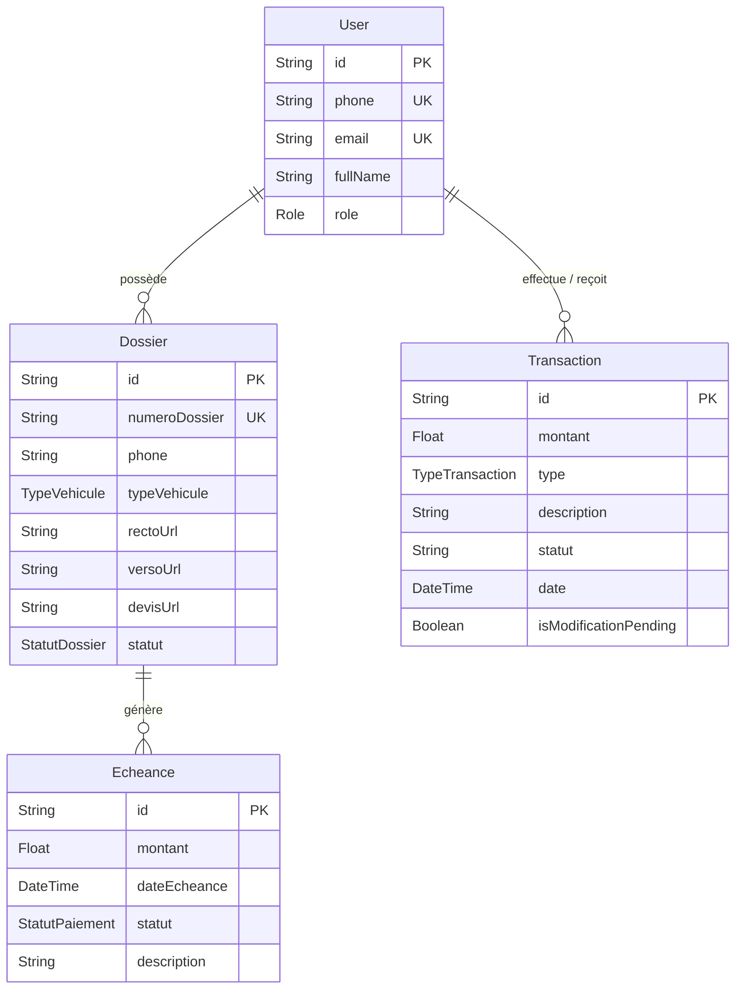

# Modèle du Domaine

Le modèle de données s'articule autour de trois axes principaux : Utilisateurs, Dossiers (Devis) et Finances.

## Diagramme Entité-Relation (ERD)

## Entités Principales

### 1. `User` (Clients et Admins)
Gère l'authentification et les rôles (`CLIENT`, `ADMIN`, `AGENT`). Les clients sont identifiés par leur numéro de téléphone de manière unique.

### 2. `Dossier` (Demandes de Devis)
Un dossier représente une demande de devis d'assurance. Il sert à la fois de demande, de collecte de documents et de suivi de contrat implicite.

### 3. `InsuranceContract` (Contrats d'Assurance)
Entité centrale modélisant la police d'assurance active ou archivée.
- Supporte deux modes de saisie : `AUTOMATIQUE` (via OCR/IA et validation humaine obligatoire) ou `MANUEL` (saisie directe sans OCR).
- Gère l'historique des renouvellements via auto-référence `previousContractId`.
- Lié de façon optionnelle à un `User` et/ou un `Dossier`.

### 4. `InsuranceAttestation` (Attestations d'Assurance)
Représente l'attestation légale d'assurance rattachée à un contrat :
- Chemins de stockage pour le document PDF original et l'image PNG (affichée directement dans WhatsApp).
- Statuts de cycle de vie : `EN_ATTENTE`, `VALIDE`, `REMPLACEE`, `REVOGUEE`, `ANNULEE`.

### 5. `AttestationAccessToken` (Jetons de Téléchargement Sécurisés)
Garantit l'accès public sécurisé et sans connexion au PDF de l'attestation :
- Empreinte cryptographique SHA-256 stockée en base (`tokenHash`), jeton brut jamais persisté.
- Validité bornée strictement par la date d'expiration de l'attestation (`expiresAt`).
- Invariant strict : généré uniquement lorsqu'une attestation PDF réellement disponible et validée existe.

### 6. `InsuranceReminder` (Rappels d'Expiration WhatsApp)
Modélise les alertes proactives d'échéance :
- Types stricts : `J_MINUS_7` (7 jours avant) et `J_MINUS_2` (2 jours avant) à 08:00 heure de Dakar (`Africa/Dakar`).
- Statuts : `PREVU`, `ENVOYE`, `ECHOUE`, `ANNULE`.
- Annulés et recalculés automatiquement en cas de modification de date d'expiration ou de renouvellement.

### 7. `Echeance`
Permet théoriquement de lier des dates limites de paiement à un dossier, avec un statut (`A_VENIR`, `PAYE`, `EN_RETARD`).

### 8. `Transaction` (Dettes, Créances, Paiements)
Journal financier lié à un `User`. Contient 4 types d'opérations financières : `PAIEMENT`, `DETTE`, `CREANCE`, `REMBOURSEMENT`.
