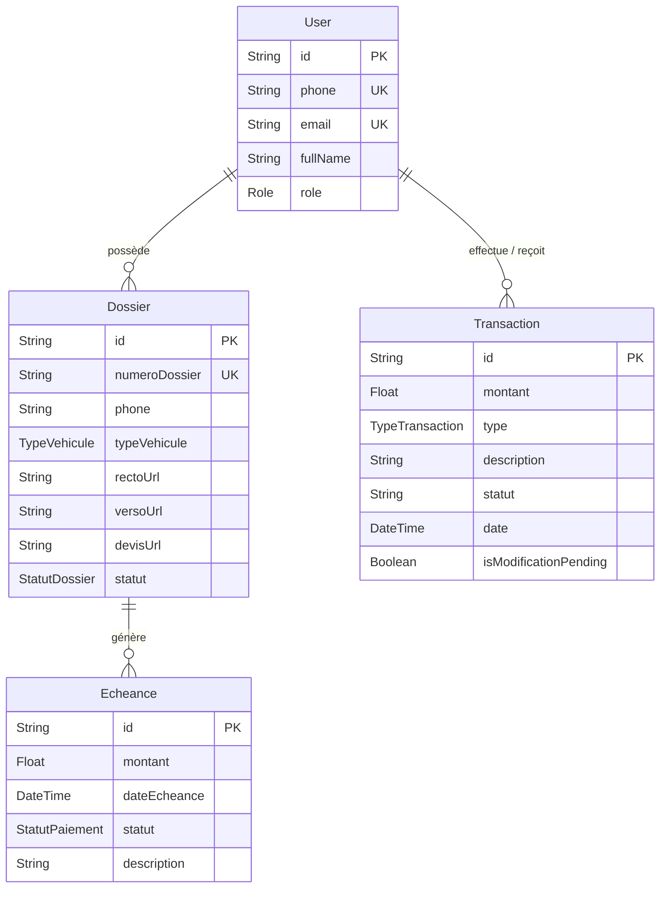

# Modèle du Domaine

Le modèle de données s'articule autour de trois axes principaux : Utilisateurs, Dossiers (Devis) et Finances.

## Diagramme Entité-Relation (ERD)

## Entités Principales

### 1. `User` (Clients et Admins)
Gère l'authentification et les rôles (`CLIENT`, `ADMIN`, `AGENT`). Les clients sont identifiés par leur numéro de téléphone de manière unique.

### 2. `Dossier` (Demandes de Devis)
Un dossier représente une demande de devis d'assurance. Il n'y a pas d'entité `InsuranceContract` (contrat d'assurance) distincte pour l'instant. Le dossier sert à la fois de demande et de suivi de contrat implicite.

### 3. `Echeance`
Permet théoriquement de lier des dates limites de paiement à un dossier, avec un statut (`A_VENIR`, `PAYE`, `EN_RETARD`). Cependant, les échéances ne semblent pas massivement intégrées aux actions actuelles.

### 4. `Transaction` (Dettes, Créances, Paiements)
Journal financier lié à un `User`. Contient 4 types d'opérations financières : `PAIEMENT`, `DETTE`, `CREANCE`, `REMBOURSEMENT`.
